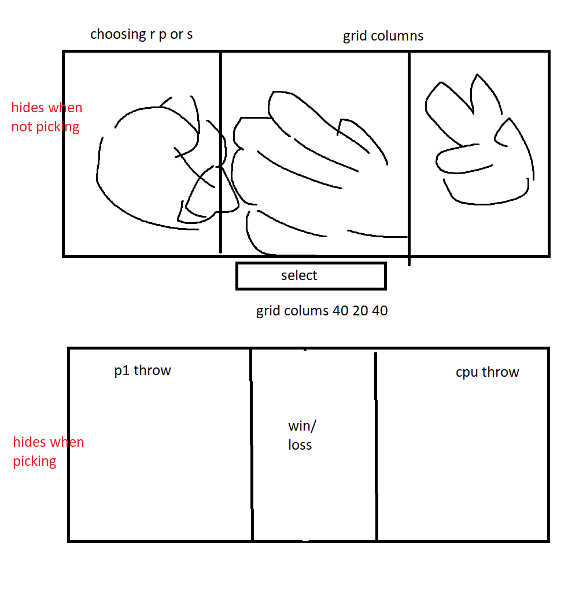

## The Golden Rule:

🦸 🦸‍♂️ `Stop starting and start finishing.` 🏁

1. Limit Work in Progress (WIP)
1. Validate each line of code before moving forward
1. Keep it Simple Simon (KISS)

## Making a plan

1. build html/css
2. grab dom elements
3. add event listeners
4. build game logic
5. build finding the champion
6. build adding classes for hiding
7. build updateDisplay

1. components:

- hidden class to display sections when choosing

2. state:
- wins:
- losses:
- draws:
- games:
- throwArray: ['rock', 'paper', 'scissors']
- playerThrow
- cpuThrow

3. events
- playerSelect
- cpuSelect
- result
- updateDisplay
- updateScore

playerSelect:
 - player selects image and clicks select button, updates playerThrow
 
 cpuSelect:
 - chooses cpu input and updates cpuSelect

result:
- finds winner and loser

updateDisplay: 
- which parts to hide when picking and not picking

updateScore:
- update the display for wins losses draws and games

## Guide to `app.js`

File parts:

1. import
2. state
3. components (one or more)
4. page load

Detailed description:

1. Imports 
    - bring in utility functions plus tested logic and render functions
1. State
    - data changes over time
    - constants with special meaning
1. View Components
    - Logical, meaningful, user-facing units of the UI 
    - Variables with DOM elements (A DOM element can only belong to one component)
    - Display functions that use state to render or update the view
    - Event subscriptions for DOM elements in this component
1. Handler Logic
    - Functions that perform actions based on events
    - directly in event handlers or grouped into `handleAction` functions
    - (call third party services)
    - Apply application logic
    - Update state
    - Call display functions to update view
1. Page Load
    - Logical pseudo-event of the initial page load
    - Like a "Handle Action" function, but code just goes at bottom of page

### Components

Logically grouped parts of the UI. A simple app may only have one component. Break each of these sections down into:

1. Define variables and assign via document methods (`getElementById`). A DOM element should only ever belong to one component
1. Display functions. These utilize the state and dom variables to perform dom updates. They may utilize user-facing formatting functions
1. Subscribe to needed events on DOM elements. These should update state or call state update functions

### Import

If needed, import functions and other JavaScript from their own modules. These will generally be pure functions:

1. App logic (game scoring)
1. Render functions (create html dynamically)
1. Utility functions (formatting, get a random number, etc.)

### State

The data that will change over time. Typically defined as `let` variables. These will be set and read from other code on the page.

#### Handler Functions

Code in event handlers, or repetitive code that is then grouped into handleAction functions. This code sites in-between events and state.

### Page Load

Code that should run when the page loads (other than event subscriptions which have already happened)

## TDD Pure Functions

- App and game logic functions that are pure and can be unit tested (TDD)
- Render functions (return dynamic Html based on input parameters)